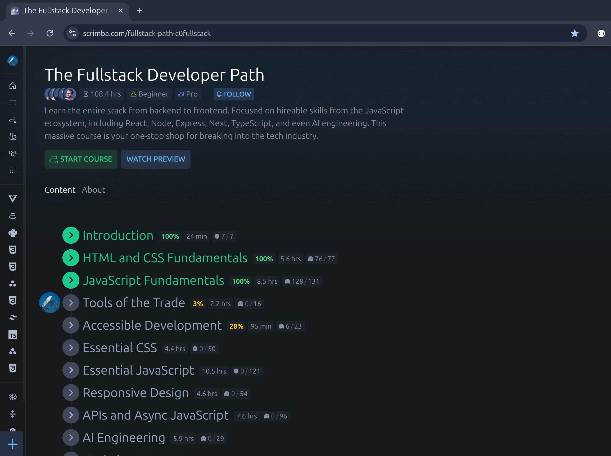
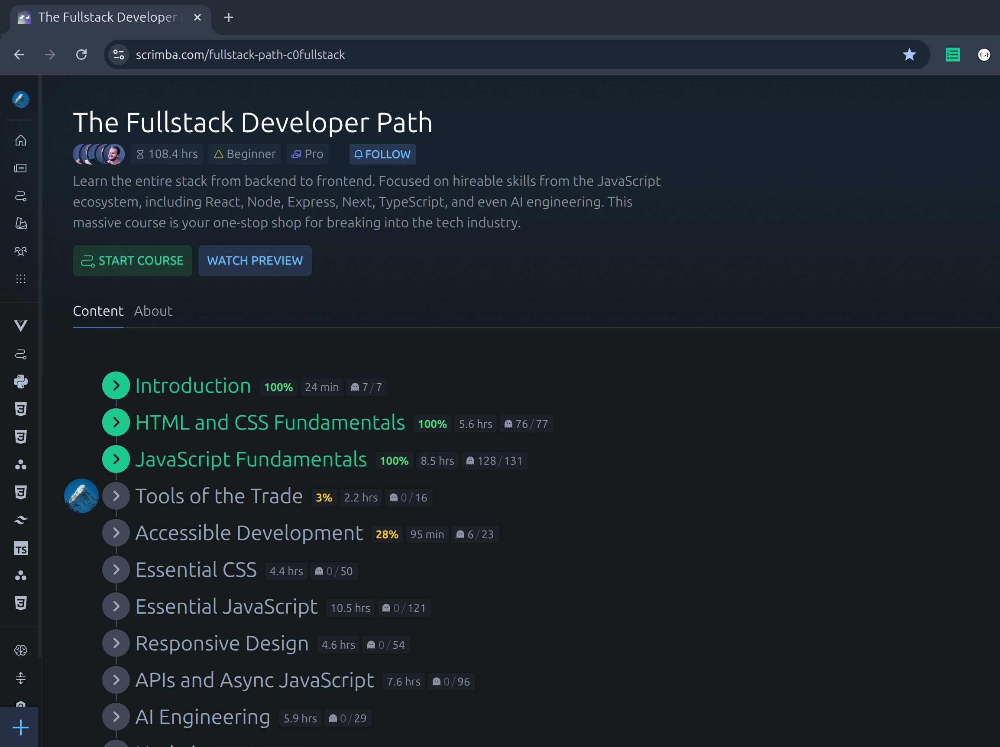
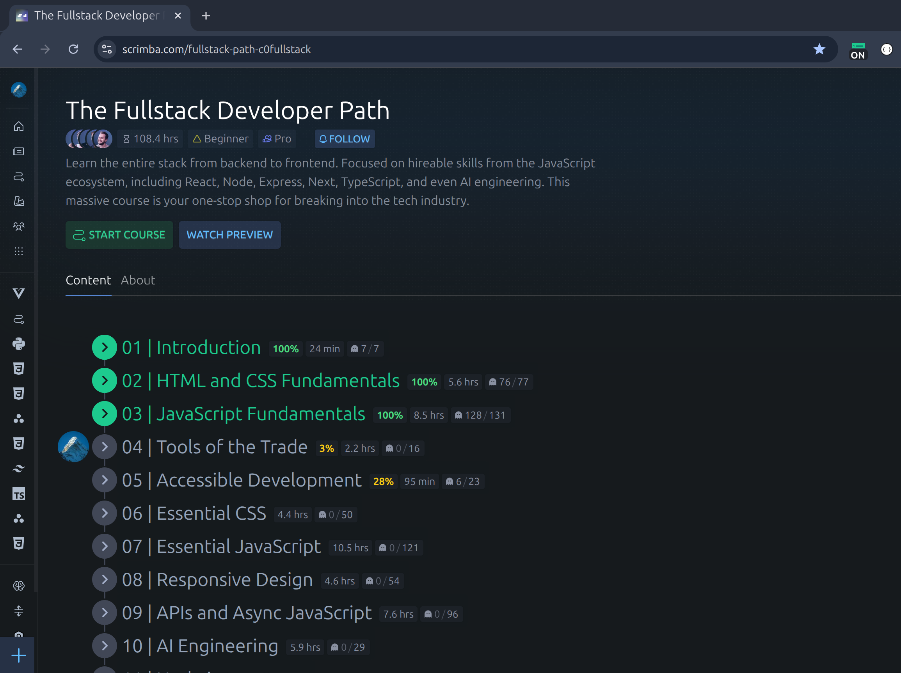
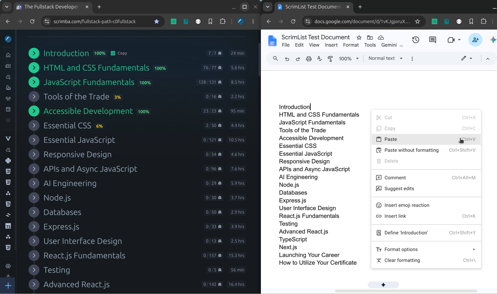

# ScrimList

ScrimList is a Google Chrome Extension that automatically numbers topics for any course in Scrimba. 
This helps learners quickly identify the number and sequence of topics for a course. 
There is no need to manually count or guess the number of topics anymore when learning on Scrimba. 

As a learner on Scrimba, I have developed this extension independently. 

This extension is **not** officially endorsed or affiliated with Scrimba.

# Installation

* First clone the repository and note the directory location.
* We next have to [load the unpacked extension](https://developer.chrome.com/docs/extensions/get-started/tutorial/hello-world#load-unpacked) for the above directory.
* Load the directory cloned earlier as an unpacked extension and pin the extension.

# Usage

Once installed open a course or path such as [Full Stack Developer Path](https://scrimba.com/fullstack-path-c0fullstack)

Please refer to the Demo video below : [video](https://www.youtube.com/watch?v=bYJ4xlBFBpg)

<video src="https://github.com/user-attachments/assets/16cf20e0-6767-4329-946a-9f41ef069429" width="80%" controls></video>

The demo concisely illustrates the various aspects of this tool.

# Features

Let's briefly review the features of scrimList below.

## Enable Number Prefixes

When the extension is active, the icon displays  and the lessons will be numbered.

In case, they do not appear, try reloading the page.

## Disable Number Prefixes

To disable numbering, first ensure the ScrimList Icon is disabled, displays  and then refresh the page.

If the numbering still appears, try reloading the page.

## Copy to Clipboard

To copy to clipboard with number prefixes, first render the number prefixes by enabling the extension.

The copy element is also enabled when the extension is not activated as shown below.

Thus, the list of topics can be copied with or without the number prefixes.

# Summary

As a Scrimba learner prefixing numbers before each lesson helps identify the progress better as it is made.

If like me, you too are a Scrimba learner and are using numbers to prefix each lesson while taking notes or creating directories to store the contents, installing `scrimList` eliminates the need for counting manually and also eliminates mistakes that occur due to human error when counting manually. 

If you are interested in learning development or sharpening your existing skills, [use my affiliate link to join Scrimba](https://scrimba.com/?via=u0knhm) and improve your development skills as Scrimba is an excellent platform especially for learning HTML, CSS, Javascript, Typescript, React and other tools used in Front End Development.
